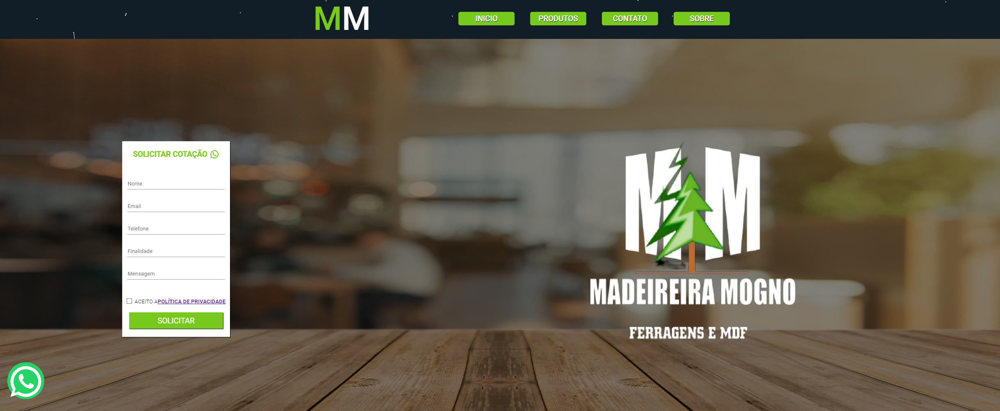

<h1 align="center">Madeireira Mogno</h1>

Este projeto é um projeto real desenvolvido para a empresa em questão

#

## Projeto 

O projeto consiste em um site completo desenvolvido em ReactJS, com algumas rotas para o usuário, além de contar com um sistema de contato automático que foi criado utilizando node. A aplicação não é nada extremamente robusto, mas por ter sido feita por um dev front-end, creio que tenha bastante conteúdo.

 

## Tecnologias 🔧

- ReactJS
- TypeScript
- Framer Motion
- Font Awesome
- EmailJS
- NodeJS
- Nodemailer
- React-WhatsApp
- React-Router
- Twilio
- React Paginate
- React Input Mask
- Cosumo de API Local

 

## Deploy 🚀

Para ver o projeto em ação pode se utilizar a vercel, onde não tive problemas para realizar o deploy da aplicação.

[Deploy](https://madeireira-mogno.vercel.app/)

 

## Mais informações 📚

- Este projeto está como público no github por achar que por ser um projeto real e um pouco maior, pode agregar muito conhecimento e visibilidade.
- Não vou deixar instruções de utilização pois esse não é um projeto que exatamente vai ser utilizado, para ser clonado e modificado por outros devs, apesar de entender que pode acontecer e não vejo problemas com isso.
- O projeto não tem nada de muito grande, mas na minha visão foi bem contruído.

 

## Licença 📝

[MIT]()

 

#

Desenvolvido por Lucas P para a empresa Madeireira Mogno
